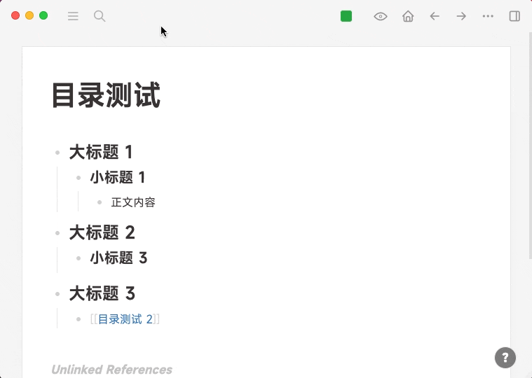
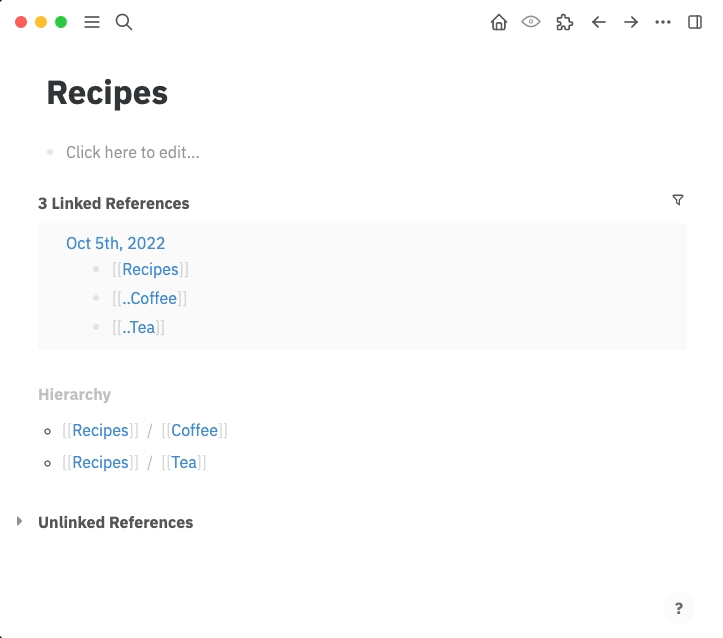

# logseq-plugin-tocgen

在任何地方生成任一页面/块的目录，通过它你可以快速访问页面/块内容。同时提供了滚动回页面顶部和底部的功能。注意目录是根据块层级来生成的。

Generate a TOC of any page/block anywhere and quickly access the page/block's content. Buttons that go to top and bottom are also provided. Notice that the TOC is generated based on block levels.

## 功能展示 (Feature Highlights)

- 自动与内容同步 (Sync with content automatically)
- Shift 点击可在侧边栏打开 (Shift click to open in the sidebar)
- 多种展开收起方式 (Multiple ways to expand and collapse)
- 实时追踪编辑位置并在目录上高亮展示 (Realtime tracking and highlighting of the current editing position in TOC)
- 嵌入块、嵌入页也能完美支持 (Embedded blocks and pages are supported)
- 拖拽管理文档结构 (Drag and drop to organize the document structure)
- 跟随主编辑页面变化的动态目录 (Dynamic TOC that follows the main page being edited)

## 使用展示 (Usage)

场景一，动态目录 (Scenario 1, dynamic TOC)

https://user-images.githubusercontent.com/3410293/196385678-ba12ad05-6729-4909-b527-83f5d062fd07.mp4

场景二，页面内目录 (Scenario 2, inline TOC)



支持生成嵌入块/页面的目录 (Support generating TOC entries for embedded blocks/pages)



上面的演示用到了 [Another Embed](https://github.com/sethyuan/logseq-plugin-another-embed) 插件，推荐大家尝试。缩短 namespace 的效果的脚本是我写的 `custom.js` 的一部分，代码可在[这里](https://gist.github.com/sethyuan/4ea9ed4305d0145ad565b2128ae6cef4)获取。

The demo above used the plugin [Another Embed](https://github.com/sethyuan/logseq-plugin-another-embed), you're welcome to try it. The namespace collapsing behavior is part of my `custom.js`, you can find the code [here](https://gist.github.com/sethyuan/4ea9ed4305d0145ad565b2128ae6cef4).

## 使用示例 (Examples)

```
为块所在的页面生成TOC。
Generate a TOC for the page where block belongs to.
{{renderer :tocgen}}
{{renderer :tocgen, [[]]}}

为某一页面创建一个TOC，可以用 "[[" 辅助查找想要的页面。
Create a TOC for a page, you can use "[[" to help find the page.
{{renderer :tocgen, pagename}}
{{renderer :tocgen, [[pagename]]}}

你也可以为某一页面块创建一个TOC，直接将块引用粘贴进来就好。
You can also create a TOC for a block, just paste its reference in.
{{renderer :tocgen, ((block-reference))}}

可以指定要生成几级。
You can specify how many levels to generate.
{{renderer :tocgen, [[]], 2}}
{{renderer :tocgen, [[pagename]], 2}}
{{renderer :tocgen, ((block-reference)), 2}}

如果你想在TOC中只包含H1-Hn这种heading，即markdown的`#`至`######`，那么你可以再通过一个参数来指定。
If you want to include only H1-Hn headings, that is, `#` to `######` in markdown,
you need to use a third argument.
{{renderer :tocgen, [[]], 1, h}}
{{renderer :tocgen, [[page name]], 1, h}}
{{renderer :tocgen, ((block-reference)), 1, h}}
```

如果你想生成一个随当前浏览页面变动而变动的 TOC，你可以传`*`作为页面名。

If you want to generate a TOC that dynamically changes according to what page you're currently working on, you can use `*` as page name.

```
{{renderer :tocgen, *}}
{{renderer :tocgen, *, 2}}
{{renderer :tocgen, *, 2, h}}
```

如果有某一块你不想列入 TOC 之中，那么你可以通过为其指定一个 `toc:: no` 块属性。

If there is a block that you don't want it to appear in TOC, you can give it a `toc:: no` block property.

## 自定义样式 (Style Customization)

你可以通过以下几个 CSS 类来自定义样式，`kef-tocgen-page` 对应页面，`kef-tocgen-block` 对应块，`.kef-tocgen-active-block` 对应编辑中的块。参照 Logseq 自定义样式的文档操作，将内容放在`custom.css`中即可。

You can customize styles using the following CSS classes, `kef-tocgen-page` for page, `kef-tocgen-block` for block, `.kef-tocgen-active-block` for active block. Refer to Logseq's document for how to customize styles, place your modifications in `custom.css`.

```css
.kef-tocgen-page {
  cursor: pointer;
  line-height: 2;
}
.kef-tocgen-block {
  line-height: 1.7;
}
.kef-tocgen-active-block {
  font-size: 1.1em;
  font-weight: 600;
}
```

你也可以通过`kef-tocgen-noactivepage`来自定义动态 TOC（见使用示例）在没有检测到活动页面时的内容与样式。

You can also use `kef-tocgen-noactivepage` to customize dynamic TOC's (see Examples section above) content and style when no active page is detected.

```css
.kef-tocgen-noactivepage::before {
  content: "🈚️";
}
```
