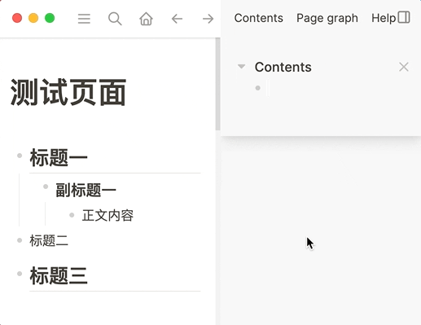
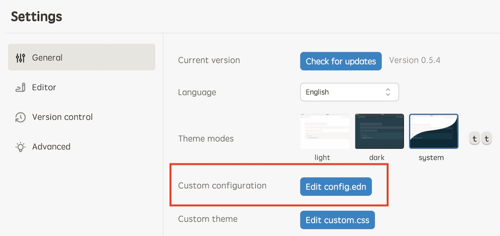

# logseq-plugin-tocgen

在任何地方生成任一页面/块的目录，通过它你可以快速访问页面/块内容。

Generate a TOC of any page/block anywhere and quickly access the page/block's content.

## 使用展示 (Usage)



## 设置宏 (Setup macro)

为了让插件更方便使用，你可能会希望参照如下说明来创建一个宏。

You also might want to follow the steps below to setup a macro to help facilitate the use of the plugin.



找到定义`macros`的位置，参照如下代码进行配置（其中的`progress`宏是可以不要的）：

Find where `macros` are configured, make adjustments according the following code (The `progress` macro is not needed):

```clojure
 ;; Macros replace texts and will make you more productive.
 ;; For example:
 ;; Add this to the macros below:
 ;; {"poem" "Rose is $1, violet's $2. Life's ordered: Org assists you."}
 ;; input "{{{poem red,blue}}}"
 ;; becomes
 ;; Rose is red, violet's blue. Life's ordered: Org assists you.
 :macros
 {"progress" "<progress value=\"$1\" max=\"100\" />"
  "toc" "{{renderer :tocgen, $1, $2}}"}
```

## 使用示例 (Examples)

这里给出的创建 TOC 的示例都是基于宏的，如果你还没有设置过，请先参照上面说明进行设置。

Examples given here are based on macros, if you haven't already setup the macro, please do so following the previous section.

```
为某一页面创建一个TOC，可以用 "[[" 辅助查找想要的页面。
Create a TOC for a page, you can use "[[" to help find the page.
{{{toc pagename}}}
{{{toc [[pagename]]}}}

可以指定要生成几级。
You can specify how many levels to generate.
{{{toc pagename, 2}}}
{{{toc [[pagename]], 2}}}

你也可以为某一页面块创建一个TOC，直接将块引用粘贴进来就好。
You can also create a TOC for a block, just paste its reference in.
{{{toc ((block-reference))}}}
{{{toc ((block-reference)), 2}}}
```

## 用户配置 (User configs)

```json
{
  "disabled": false,
  "defaultLevels": 1,
  "defaultCollaped": false
}
```

在 Logseq 的插件页面打开插件的配置后，有以下几项配置可供使用，请参照上方代码块进行设置（各项的默认值以体现在代码块中）：

- `defaultLevels`: 默认创建目录的级数，创建目录时没有指定级数时会使用此设置。
- `defaultCollapsed`: 默认目录是否为折叠状态。

There are a couple of user settings available when you access the plugin settings from Logseq's plugins page. Please refer to the source block above (Default values are given in the source block).

- `defaultLevels`: It defines how many levels a TOC contains by default if not specified when the TOC is created.
- `defaultCollapsed`: It defines whether TOC is collapsed by default.
